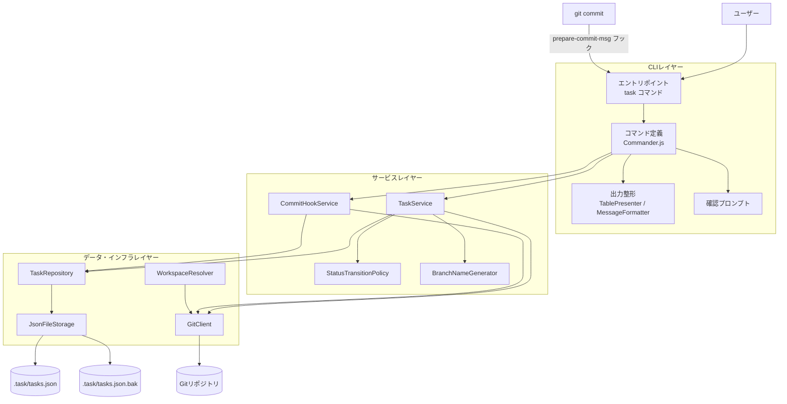
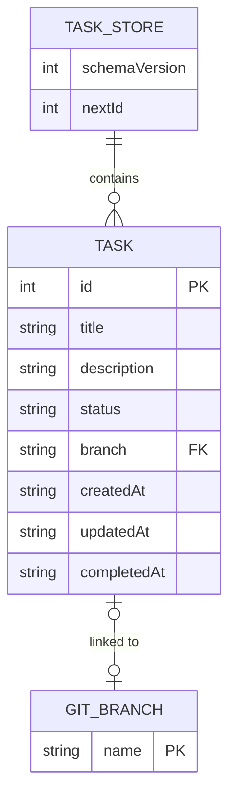
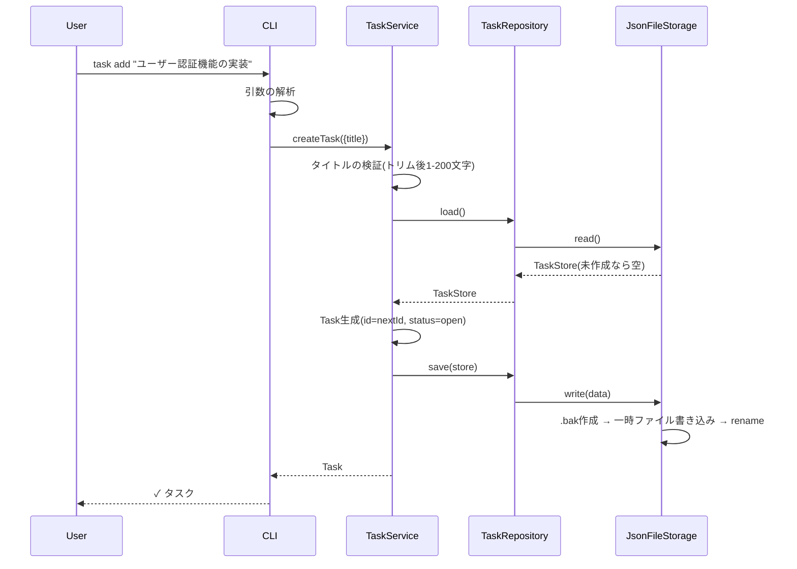
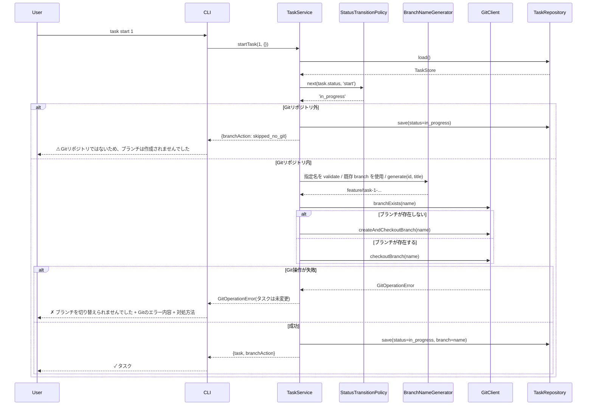
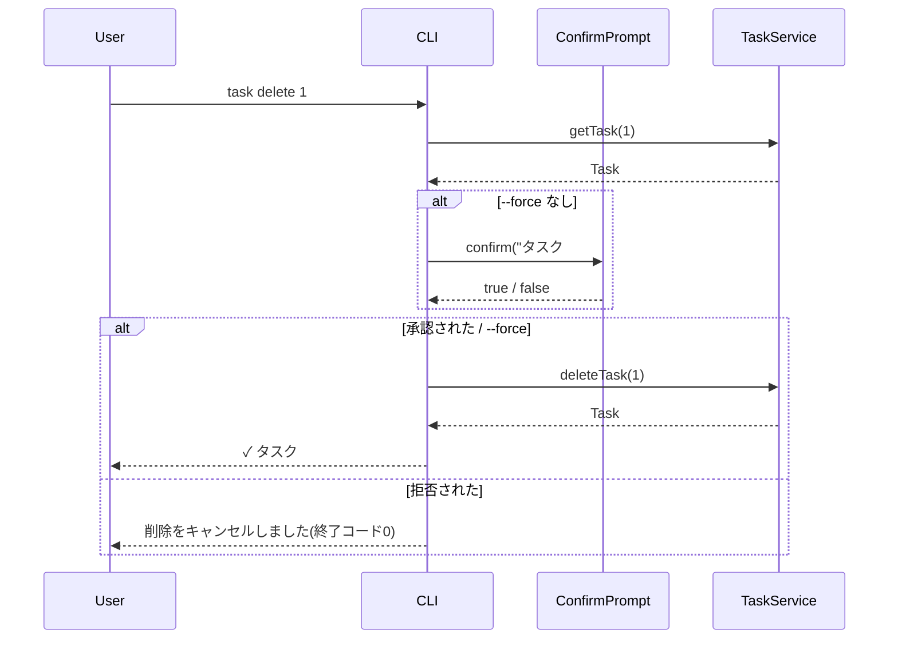
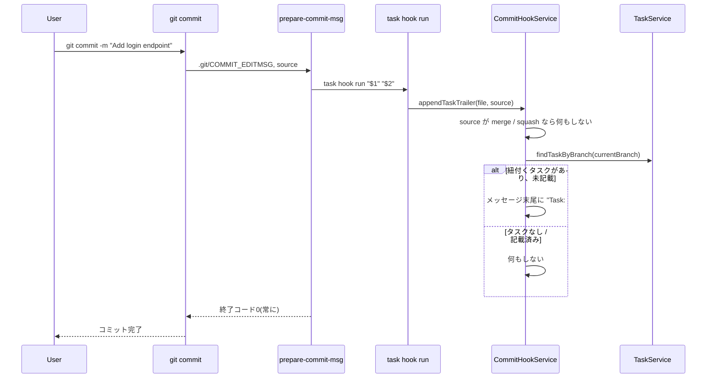
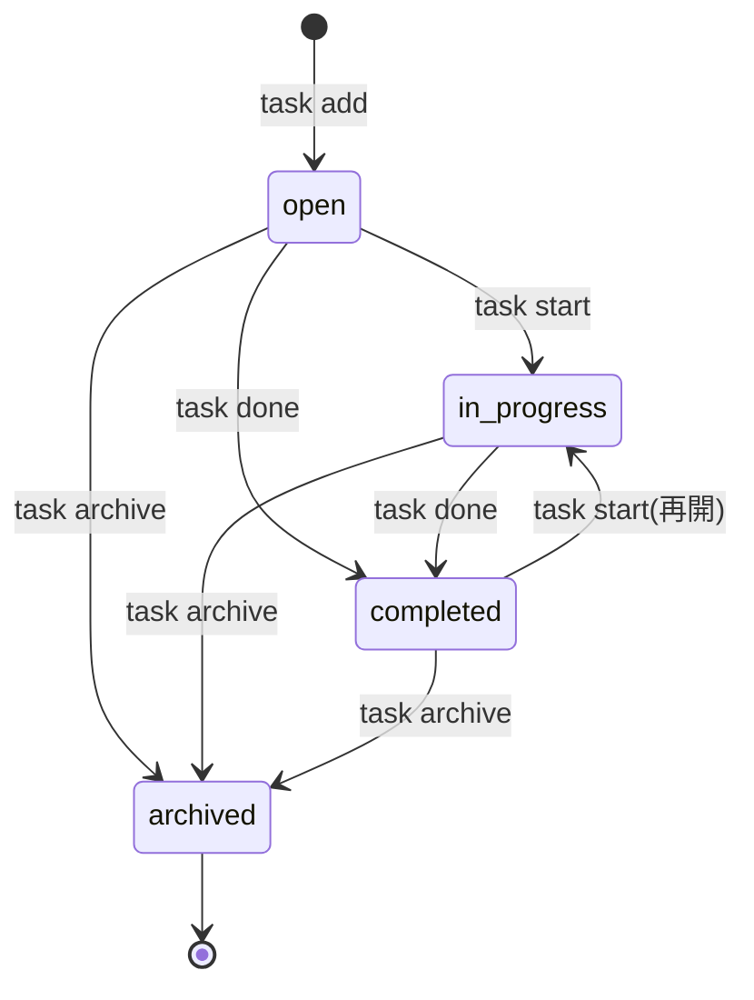

# 機能設計書 (Functional Design Document)

本書は [プロダクト要求定義書](./product-requirements.md) で定義したMVP(P0)機能を、どのように実現するかを定義する。
P1以降の機能は、MVPの設計が拡張を妨げないことを確認する目的でのみ言及する。

## システム構成図



**レイヤーの依存方向**: CLI → サービス → データ・インフラ の一方向のみとする。サービスレイヤーは標準出力・プロンプトに依存せず、結果を値として返す。

## 技術スタック

| 分類 | 技術 | 選定理由 |
|------|------|----------|
| 言語 | TypeScript 5.x | 型によるデータモデルの明確化。プロジェクトの標準 |
| 実行環境 | Node.js 20 LTS以降 | PRDの互換性要件。npmでの配布が容易 |
| CLIフレームワーク | Commander.js | 学習コストが低く、サブコマンド・ヘルプ・類似コマンド提案を標準で備える |
| Git操作 | simple-git | 引数配列でgitを実行するためコマンドインジェクションを防げる |
| 表示幅計算 | string-width | 全角文字を含むタイトルの列揃えに必要 |
| 色付け | picocolors | 軽量で起動時間への影響が小さい。`NO_COLOR` に対応 |
| データ保存 | JSONファイル | 追加ソフトウェア不要、Gitで共有可能。1,000件規模で十分な性能 |
| テスト | Vitest | プロジェクトの標準 |

詳細なバージョンと選定根拠は [architecture.md](./architecture.md) で定義する。

## データモデル定義

### エンティティ: Task

```typescript
type TaskStatus = 'open' | 'in_progress' | 'completed' | 'archived';

interface Task {
  id: number;              // 1から始まる連番の整数。削除後も再利用しない
  title: string;           // 1-200文字(前後の空白はトリム後に判定)
  description?: string;    // 任意。最大10,000文字
  status: TaskStatus;      // 初期値 'open'
  branch?: string;         // 紐付くGitブランチ名。task start 時に設定
  createdAt: string;       // 作成日時(ISO 8601、UTC)
  updatedAt: string;       // 更新日時(ISO 8601、UTC)
  completedAt?: string;    // 完了日時(ISO 8601、UTC)。completed 遷移時に設定
}
```

**制約**:
- `id` はファイル内で一意。採番は `TaskStore.nextId` を用い、使用後にインクリメントする
- `title` は改行を含まない(改行は半角スペースに置換して保存)
- `branch` は `completed` から `in_progress` に再開した場合も保持し、`task start` 時に同じブランチへ切り替える
- `completedAt` は `completed` 以外に遷移した場合も履歴として保持する(再完了時に上書き)
- 日時はJSONでの可搬性のため `Date` ではなく ISO 8601 文字列で保持する

### エンティティ: TaskStore(ファイル全体)

```typescript
interface TaskStore {
  schemaVersion: 1;        // データ形式のバージョン。将来のマイグレーションに使用
  nextId: number;          // 次に採番するID(初期値 1)
  tasks: Task[];           // ID昇順で保存
}
```

**制約**:
- `nextId` は常に `max(tasks[].id) + 1` 以上
- 読み込んだ `schemaVersion` が現行より新しい場合は、ツールの更新を促すエラーとする(データを上書きしない)

### エンティティ: Workspace(実行時のみ、永続化しない)

```typescript
interface Workspace {
  rootDir: string;         // .task/ を配置するディレクトリ(絶対パス)
  isGitRepository: boolean;// Gitリポジトリ内で実行されているか
  dataDir: string;         // `${rootDir}/.task`
}
```

### ER図



`GIT_BRANCH` はTaskCLIが管理するデータではなく、Gitリポジトリ側の実体である。タスクはブランチ名を文字列として参照するのみで、ブランチが削除されてもタスクの `branch` は保持する。

## コンポーネント設計

### CLIレイヤー

#### エントリポイント / コマンド定義

**責務**:
- 引数の解析とコマンドへのディスパッチ(Commander.js)
- 引数の型変換(ID文字列 → 正の整数)と形式チェック
- サービスの呼び出しと、結果の Presenter への受け渡し
- 例外を捕捉し、エラーメッセージの表示と終了コードの決定を行う

**インターフェース**:
```typescript
// 各コマンドはこの形で定義し、エントリポイントで登録する
interface CommandContext {
  workspace: Workspace;
  taskService: TaskService;
  hookService: CommitHookService;
  git: GitPort;             // 現在ブランチの取得(task list のマーカー表示)
  output: Output;           // stdout/stderr とTTY判定の抽象
  prompt: ConfirmPrompt;
}

function registerCommands(program: Command, createContext: () => Promise<CommandContext>): void;
```

**依存関係**:
- TaskService, CommitHookService, WorkspaceResolver
- TablePresenter, MessageFormatter, ConfirmPrompt

#### TablePresenter

**責務**:
- タスク一覧を表形式の文字列に整形する(全角文字の表示幅を考慮)
- 現在のブランチに紐付く行に `*` を付与する
- TTY・`NO_COLOR` に応じて色付けの有無を切り替える

**インターフェース**:
```typescript
interface TableOptions {
  currentBranch?: string;
  color: boolean;
}

class TablePresenter {
  renderTaskList(tasks: Task[], options: TableOptions): string;
  renderTaskDetail(task: Task, options: { color: boolean }): string;
}
```

#### ConfirmPrompt

**責務**:
- `y/N` 形式の確認を行う。`y` / `yes`(大文字小文字を区別しない)のみ肯定とする
- 標準入力から1行を読み取って判定する(パイプ入力 `echo y | task delete 1` にも対応)。入力を得られないまま標準入力が終端に達した場合は確認できないため削除を中止し、`--force` の利用を案内して終了コード1で終了する

```typescript
interface ConfirmPrompt {
  confirm(message: string): Promise<boolean>;
}
```

### サービスレイヤー

#### TaskService

**責務**:
- タスクの作成・取得・一覧・削除
- ステータス変更(StatusTransitionPolicy に遷移可否を問い合わせる)
- タスク開始時のブランチ作成・切り替えとタスクへの紐付け
- Git操作とデータ保存の順序を制御し、Git操作失敗時にデータを変更しない

**インターフェース**:
```typescript
interface CreateTaskInput {
  title: string;
  description?: string;
}

interface ListOptions {
  includeArchived: boolean;
  statuses?: readonly TaskStatus[];  // 指定時はこのステータスのみ返す(archived を含めば includeArchived に関係なく返す。空配列は未指定扱い)
}

interface ListResult {
  tasks: Task[];
  hiddenArchivedCount: number;  // 一覧から除外したアーカイブ済みタスクの件数(0件時の案内用)
}

interface StartTaskOptions {
  branch?: string;          // --branch で指定されたブランチ名
}

interface StartTaskResult {
  task: Task;
  branchAction: 'created' | 'switched' | 'skipped_no_git';
}

class TaskService {
  constructor(repo: TaskRepository, git: GitClient, workspace: Workspace,
              policy: StatusTransitionPolicy, namer: BranchNameGenerator, clock: Clock);

  createTask(input: CreateTaskInput): Promise<Task>;
  getTask(id: number): Promise<Task>;                  // 見つからなければ TaskNotFoundError
  listTasks(options: ListOptions): Promise<ListResult>;
  searchTasks(keyword: string, options: ListOptions): Promise<ListResult>;  // 空キーワードは ValidationError
  deleteTask(id: number): Promise<Task>;               // 削除したタスクを返す
  startTask(id: number, options: StartTaskOptions): Promise<StartTaskResult>;
  completeTask(id: number): Promise<Task>;
  archiveTask(id: number): Promise<Task>;
  findTaskByBranch(branch: string): Promise<Task | undefined>;
}
```

**依存関係**: TaskRepository, GitClient, StatusTransitionPolicy, BranchNameGenerator, Clock(現在時刻の抽象。テストで固定するため)

TaskRepository と GitClient は、実際にはサービスレイヤーが定義するインターフェース(`TaskRepositoryPort` / `GitPort`)として受け取る(配置は [repository-structure.md](./repository-structure.md) を参照)。

#### StatusTransitionPolicy

**責務**: ステータス遷移の可否を判定する(純粋関数)

```typescript
type TaskAction = 'start' | 'complete' | 'archive';

class StatusTransitionPolicy {
  // 遷移後のステータスを返す。不可の場合は InvalidStatusTransitionError
  next(current: TaskStatus, action: TaskAction): TaskStatus;
}
```

#### BranchNameGenerator

**責務**:
- タスクIDとタイトルからブランチ名を生成する
- ユーザー指定のブランチ名を検証する

```typescript
class BranchNameGenerator {
  constructor(git: GitClient);       // validate で git check-ref-format を使用するため

  generate(id: number, title: string): string;
  validate(name: string): Promise<void>;  // 不正な場合は InvalidBranchNameError
}
```

#### CommitHookService

**責務**:
- `prepare-commit-msg` フックのインストール・アンインストール
- コミットメッセージへの `Task: #<id>` 追記(フックから呼ばれる)

```typescript
type InstallResult = 'installed' | 'already_installed' | 'conflict';

class CommitHookService {
  install(): Promise<InstallResult>;
  uninstall(): Promise<'uninstalled' | 'not_installed' | 'not_owned'>;
  appendTaskTrailer(messageFile: string, source?: string): Promise<void>;
}
```

### データ・インフラレイヤー

#### WorkspaceResolver

**責務**: 実行ディレクトリから `.task/` の配置場所を決定する

```typescript
class WorkspaceResolver {
  resolve(cwd: string): Promise<Workspace>;
}
```

**解決ルール**:
1. `git rev-parse --show-toplevel` が成功した場合、その結果を `rootDir` とし `isGitRepository = true`
2. 失敗した場合(リポジトリ外、またはGit未インストール)、`cwd` を `rootDir` とし `isGitRepository = false`

#### TaskRepository

**責務**: TaskStore の読み込み・保存をドメインの言葉で提供する。ID採番を担う

```typescript
class TaskRepository {
  constructor(storage: JsonFileStorage);

  load(): Promise<TaskStore>;                          // ファイルがなければ空のストアを返す
  save(store: TaskStore): Promise<void>;
  initialize(): Promise<'created' | 'already_exists'>;
}
```

**データアクセスの抽象化**: サービスレイヤーは TaskRepository のみに依存する。将来SQLiteに移行する際は TaskRepository の実装を差し替える。

#### JsonFileStorage

**責務**: JSONファイルの安全な読み書き(アトミック書き込み・バックアップ・破損検知)

```typescript
class JsonFileStorage {
  constructor(filePath: string);

  exists(): Promise<boolean>;
  read(): Promise<unknown>;          // 構文エラー時は CorruptedDataError
  write(data: unknown): Promise<void>;
}
```

#### GitClient

**責務**: simple-git をラップし、TaskCLIが必要とするGit操作のみを公開する

```typescript
class GitClient {
  constructor(rootDir: string);

  isAvailable(): Promise<boolean>;                     // git コマンドが実行可能か
  getRepositoryRoot(cwd: string): Promise<string | undefined>;
  getCurrentBranch(): Promise<string | undefined>;     // detached HEAD の場合 undefined
  branchExists(name: string): Promise<boolean>;
  createAndCheckoutBranch(name: string): Promise<void>;
  checkoutBranch(name: string): Promise<void>;
  isValidBranchName(name: string): Promise<boolean>;   // git check-ref-format --branch
  getHooksDir(): Promise<string>;                      // git rev-parse --git-path hooks
}
```

すべてのGit操作は引数配列で実行し、シェルを経由しない。Git側のエラーは `GitOperationError`(Gitの標準エラー出力を保持)に変換して送出する。

## ユースケース図

### UC1: タスクの追加(`task add`)



**フロー説明**:
1. CLIが引数を解析し、TaskService に作成を依頼する
2. TaskService がタイトルを検証する。不正な場合は `ValidationError` を送出し、ファイルには触れない
3. ストアを読み込む。`.task/` が存在しない場合は空のストアとして扱い、保存時にディレクトリを作成する(自動初期化)
4. `nextId` でIDを採番し、`nextId` をインクリメントしてから保存する
5. 作成したタスクのIDとタイトルを表示する

### UC2: タスクの開始(`task start`)



**フロー説明**:
1. タスクを取得し、`start` による遷移が可能か判定する(`in_progress` / `archived` からは不可)
2. ブランチ名を決定する。優先順位は次のとおり
   1. `--branch` で指定された名前(BranchNameGenerator と `git check-ref-format` で検証)
   2. タスクに既に記録されている `branch`(再開時)
   3. BranchNameGenerator が生成した名前
3. **Git操作を先に行い、成功した場合のみタスクを保存する**。これにより、Git操作が失敗してもタスクデータは変更されない
4. Git操作の成功後にデータ保存が失敗した場合は、ブランチは作成済みである旨とともにエラーを表示する(再度 `task start` を実行すれば既存ブランチへの切り替えとして復旧できる)

### UC3: タスクの完了・アーカイブ(`task done` / `task archive`)

**フロー説明**:
1. タスクを取得し、StatusTransitionPolicy で遷移可否を判定する
2. `done` の場合は `status = completed`、`completedAt = 現在時刻`、`archive` の場合は `status = archived` に変更する
3. `updatedAt` を更新して保存し、結果を表示する
4. MVPでは Git操作(マージ・プッシュ)は行わない(P1で追加)

### UC4: タスクの削除(`task delete`)



`nextId` は削除で減らさないため、削除したIDは再利用されない。

### UC5: コミットメッセージへのタスク番号追記



**フロー説明**:
1. `git commit` 時に、Gitが `prepare-commit-msg` フックを起動する
2. フックスクリプトは内部コマンド `task hook run` を呼ぶ。`task` コマンドが見つからない場合は何もせず終了する
3. 現在のブランチに紐付くタスクを検索する。`status` が `archived` のタスクは対象外とする
4. メッセージ本文に正規表現 `/^Task: #\d+$/m` に一致する行がなければ、末尾に空行を1行挟んで `Task: #<id>` を追記する(Gitのトレーラー形式)
5. **フック内でエラーが起きてもコミットを妨げない**。エラーは標準エラー出力に警告として表示し、終了コード0で終了する

### UC6: フックのインストール(`task hook install`)

**フロー説明**:
1. Gitリポジトリ外の場合は `NotGitRepositoryError` とする
2. `git rev-parse --git-path hooks` でフックディレクトリを取得する(`core.hooksPath` やworktreeに対応するため)
3. `prepare-commit-msg` が存在しない場合、下記のスクリプトを作成し実行権限(0755)を付与する
4. 既に存在し、TaskCLIのマーカーコメントを含む場合は `already_installed` とする
5. 既に存在し、マーカーを含まない場合は上書きせず `conflict` とし、既存フックに追記すべき1行を案内する
6. `task hook uninstall` はマーカーを含むフックのみ削除する

**フックスクリプト**:
```sh
#!/bin/sh
# managed-by: taskcli (このコメントを削除するとTaskCLIの管理対象外になります)
command -v task >/dev/null 2>&1 || exit 0
task hook run "$1" "$2" || true
```

## 画面遷移図(タスクのステータス遷移)



**遷移表**(StatusTransitionPolicy の実装仕様):

| 現在 \ アクション | start | complete(done) | archive |
|---|---|---|---|
| open | in_progress | completed | archived |
| in_progress | ✗ 既に作業中 | completed | archived |
| completed | in_progress | ✗ 既に完了 | archived |
| archived | ✗ | ✗ | ✗ 既にアーカイブ済み |

`delete` はステータスに関係なく実行できる。

## API設計(CLIコマンド仕様)

本ツールはHTTP APIを持たないため、CLIコマンドを外部インターフェースとして定義する。

| コマンド | 引数 | オプション | 成功時の出力 | 主なエラー |
|---|---|---|---|---|
| `task init` | - | - | `✓ .task/ を初期化しました` / `既に初期化されています` | 書き込み権限なし |
| `task add <title>` | タイトル | `-d, --description <text>` | `✓ タスク #<id> を作成しました: <title>` | タイトル不正 |
| `task list` | - | `-a, --all`, `-s, --status <statuses>` | 一覧表 / 0件メッセージ | 不正なステータス、データ破損 |
| `task search <keyword...>` | 検索キーワード | `-a, --all`, `-s, --status <statuses>` | 一覧表 / `"<keyword>" に一致するタスクはありません` | 空キーワード、不正なステータス |
| `task show <id>` | ID | - | 詳細表示 | ID不正、見つからない |
| `task start <id>` | ID | `-b, --branch <name>` | `✓ タスク #<id> を開始しました(ブランチ: <name>)` | 遷移不可、ブランチ名不正、Git操作失敗 |
| `task done <id>` | ID | - | `✓ タスク #<id> を完了しました` | 遷移不可 |
| `task archive <id>` | ID | - | `✓ タスク #<id> をアーカイブしました` | 遷移不可 |
| `task delete <id>` | ID | `-f, --force` | `✓ タスク #<id> を削除しました` | 見つからない |
| `task hook install` | - | - | `✓ prepare-commit-msg フックをインストールしました` | Gitリポジトリ外、既存フックと競合 |
| `task hook uninstall` | - | - | `✓ フックを削除しました` | Gitリポジトリ外 |
| `task hook run <file> [source]` | フックから渡される値 | - | なし(内部用。ヘルプには表示しない) | 常に終了コード0 |

**ID引数の検証**: 正の整数(`/^[1-9]\d*$/`)以外は「タスクIDは正の整数で指定してください: <入力値>」とする。`#1` 形式も受け付け、先頭の `#` を除去して解釈する。

**`--status` の検証**: カンマ区切りで複数指定できる(`open,in_progress`)。前後の空白・空要素は無視し、`TASK_STATUSES` 以外の値は「不正なステータスです: <値>」(ヒント: 有効な値の一覧)とする。

**検索の一致条件**: タイトルと説明を NFKC 正規化 + 小文字化して部分一致で判定する(大文字小文字・全角半角を区別しない)。空白区切りの複数キーワードはすべてを含むタスクに一致する(AND)。正規表現は使わない。既定ではアーカイブ済みを除外し、`--all` で含める。

**終了コード**:
- `0`: 成功(削除確認でキャンセルした場合、絞り込み・検索の結果が0件の場合も含む)
- `1`: ユーザー入力エラー・実行時エラー

## アルゴリズム設計

### ブランチ名生成アルゴリズム

**目的**: タスクのタイトルから、Gitで有効かつ人間が読めるブランチ名を生成する

**入力**: `id: number`, `title: string`
**出力**: `feature/task-<id>-<slug>` または `feature/task-<id>`

#### ステップ1: 正規化
- Unicode NFKC 正規化を行う(全角英数字 `ＡＢＣ１２３` → 半角 `ABC123`)
- 小文字化する

#### ステップ2: スラグ化
- `[a-z0-9]` 以外の文字の連続を、1つのハイフンに置換する
- 先頭・末尾のハイフンを除去する

#### ステップ3: 長さ制限
- 50文字を超える場合は50文字で切り詰め、末尾のハイフンを除去する

#### ステップ4: 組み立て
- スラグが空文字の場合: `feature/task-<id>`
- それ以外: `feature/task-<id>-<slug>`

**実装例**:
```typescript
const MAX_SLUG_LENGTH = 50;

function generateBranchName(id: number, title: string): string {
  const slug = title
    .normalize('NFKC')
    .toLowerCase()
    .replace(/[^a-z0-9]+/g, '-')
    .replace(/^-+|-+$/g, '')
    .slice(0, MAX_SLUG_LENGTH)
    .replace(/-+$/, '');

  return slug === '' ? `feature/task-${id}` : `feature/task-${id}-${slug}`;
}
```

**生成例**:

| タイトル | 生成されるブランチ名 |
|---|---|
| `Initial setup` | `feature/task-3-initial-setup` |
| `ユーザー認証機能の実装` | `feature/task-1` |
| `OAuth2.0対応(Google)` | `feature/task-5-oauth2-0-google` |
| `Fix   bug!!  in  API` | `feature/task-7-fix-bug-in-api` |

### ユーザー指定ブランチ名の検証

`--branch` の値は次の順に検証し、いずれかに該当すれば `InvalidBranchNameError` とする。

1. 空文字、または先頭が `-`(Gitのオプションと誤認されるのを防ぐ)
2. `git check-ref-format --branch <name>` が失敗する

### 表示幅を考慮した列揃え

**目的**: 全角文字(表示幅2)を含むタイトルでも列を揃える

- 各セルの表示幅を `string-width` で計算する(ANSIカラーコードは幅0として扱われる)
- 列幅 = その列の全セル(ヘッダー含む)の最大表示幅
- 各セルの右側を `列幅 - セル表示幅` 個の半角スペースで埋め、列間は半角スペース2つで区切る
- タイトル列は最大表示幅50とし、超える場合は表示幅49で切り詰めて `…` を付与する(`task show` では全文を表示)
- 最終列(Branch)は右側を埋めない

### アトミックな書き込み

**目的**: 書き込み中の強制終了でデータが破損しないようにする

1. `.task/` ディレクトリがなければ作成する
2. 既存の `tasks.json` があれば `tasks.json.bak` にコピーする(上書き)
3. データを `JSON.stringify(data, null, 2) + '\n'` でシリアライズし、同じディレクトリの一時ファイル `tasks.json.<pid>.<乱数>.tmp` に書き込む
4. 一時ファイルを `tasks.json` に `rename` する(同一ファイルシステム内でアトミック)
5. 途中で失敗した場合は一時ファイルを削除する

Windowsで `rename` 先が他プロセスに開かれていて失敗する場合(`EPERM` / `EBUSY`)は、50ms間隔で最大3回再試行する。

## UI設計

### テーブル表示(`task list`)

```
  ID  Status       Title                    Branch
* 1   in_progress  ユーザー認証機能の実装    feature/task-1
  2   open         データエクスポート機能    -
  3   completed    Initial setup            feature/task-3-initial-setup
```

**表示項目**:
| 項目 | 説明 | フォーマット |
|------|------|-------------|
| (マーカー) | 現在のブランチに紐付くタスク | `*` または半角スペース |
| ID | タスクID | 整数 |
| Status | ステータス | `open` / `in_progress` / `completed` / `archived` |
| Title | タイトル | 最大表示幅50、超過分は `…` |
| Branch | 紐付くブランチ | 未設定は `-` |

**0件の場合**:
```
タスクがありません。`task add "<タイトル>"` で追加できます
```

`--all` を付けずに表示した結果が0件で、アーカイブ済みタスクが存在する場合は、`(アーカイブ済みのタスクが N 件あります。--all で表示できます)` を追記する。

`--status` 指定時の0件は `条件に一致するタスクはありません` とする(ステータスを明示しているため、アーカイブ済みの案内は出さない)。`task search` の結果も同じ表形式で表示し、0件の場合は `"<キーワード>" に一致するタスクはありません` と、キーワードに一致したが除外したアーカイブ済みタスクの案内を表示する。

### 詳細表示(`task show`)

```
タスク #1
  タイトル    : ユーザー認証機能の実装
  ステータス  : in_progress
  ブランチ    : feature/task-1
  作成日時    : 2026-10-03 10:00
  更新日時    : 2026-10-03 11:30
  完了日時    : -

  説明:
    メールアドレスとパスワードでログインできるようにする
```

日時はユーザーのローカルタイムゾーンで `YYYY-MM-DD HH:mm` 形式に変換して表示する。

### カラーコーディング

**ステータスの色分け**:
- `open`: 既定色
- `in_progress`: 黄
- `completed`: 緑
- `archived`: グレー(dim)

**メッセージの色分け**:
- 成功(`✓`): 緑
- 警告(`⚠`): 黄
- エラー(`✗`): 赤

**色付けの無効化条件**: 次のいずれかに該当する場合は色を付けない
- 出力先がTTYでない
- 環境変数 `NO_COLOR` が設定されている(値は問わない)

色を付けない場合も、記号(`✓` `⚠` `✗` `*`)とテキストで情報が伝わるようにする。

## ファイル構造

**データ保存形式**:
```
<リポジトリルート>/
└── .task/
    ├── tasks.json        # タスクデータ(Gitにコミットしてチームで共有可能)
    └── tasks.json.bak    # 直前の状態のバックアップ
```

`task init` 時に `.task/.gitignore` を作成し、`tasks.json.bak` と `*.tmp` を除外する。`tasks.json` をGitで共有するかどうかはユーザーの判断に委ねる。

**tasks.json の例**:
```json
{
  "schemaVersion": 1,
  "nextId": 4,
  "tasks": [
    {
      "id": 1,
      "title": "ユーザー認証機能の実装",
      "description": "メールアドレスとパスワードでログインできるようにする",
      "status": "in_progress",
      "branch": "feature/task-1",
      "createdAt": "2026-10-03T01:00:00.000Z",
      "updatedAt": "2026-10-03T02:30:00.000Z"
    },
    {
      "id": 3,
      "title": "Initial setup",
      "status": "completed",
      "branch": "feature/task-3-initial-setup",
      "createdAt": "2026-10-01T00:00:00.000Z",
      "updatedAt": "2026-10-02T09:00:00.000Z",
      "completedAt": "2026-10-02T09:00:00.000Z"
    }
  ]
}
```

**読み込み時の検証**: JSONとして解析できた後、`schemaVersion`・`nextId`・`tasks` の型と各タスクの必須フィールドを検証する。不整合がある場合は `CorruptedDataError` とし、ファイルを上書きしない。

## パフォーマンス最適化

- **遅延読み込み**: simple-git・string-width 等は使用するコマンドの実行時に動的 `import()` で読み込み、起動時間を抑える
- **Git呼び出しの最小化**: Git操作を伴わないコマンド(add / show / done / archive / delete)では、`WorkspaceResolver` のための `git rev-parse` 1回のみとする。`task list` は現在ブランチ取得のため追加で1回呼び出す
- **一括読み書き**: 1コマンドにつき tasks.json の読み込み・書き込みはそれぞれ最大1回とする
- **線形探索で十分**: 1,000件規模ではIDによる検索は配列の線形探索で十分高速なため、インデックスは持たない

## セキュリティ考慮事項

- **コマンドインジェクション**: Git操作はすべて simple-git 経由で引数配列として渡し、シェルを経由しない。タイトルや説明をコマンドラインに埋め込まない
- **ブランチ名の安全性**: 自動生成名は `[a-z0-9-]` と固定接頭辞のみで構成される。ユーザー指定名は `git check-ref-format` で検証し、先頭 `-` を拒否する
- **フックの安全な導入**: 既存フックを上書きしない。TaskCLIが作成したフックのみを削除対象とする
- **パスの安全性**: データファイルのパスは WorkspaceResolver が決定した `rootDir` 配下に固定し、ユーザー入力からパスを組み立てない
- **外部通信なし**: MVPではネットワーク通信を一切行わない

## エラーハンドリング

### エラーの分類

すべてのドメインエラーは `TaskCliError` を継承し、`message`(何が起きたか)と `hint`(どうすれば解決できるか)を持つ。CLIレイヤーは `✗ <message>` と `  <hint>` を標準エラー出力に表示し、終了コード1で終了する。

```typescript
abstract class TaskCliError extends Error {
  abstract readonly hint?: string;
}
```

| エラー種別 | 発生条件 | 処理 | ユーザーへの表示(message / hint) |
|-----------|---------|------|-----------------|
| ValidationError | タイトルが空・200文字超、ID形式不正 | 処理を中断、データ未変更 | `タイトルは1〜200文字で入力してください(現在: 0文字)` |
| TaskNotFoundError | 指定IDのタスクが存在しない | 処理を中断 | `タスク #5 が見つかりません` / `task list --all で既存のタスクを確認できます` |
| InvalidStatusTransitionError | 遷移表で ✗ の操作 | 処理を中断、データ未変更 | `タスク #1 は既に完了しています(completed)` / `再開する場合は task start 1 を実行してください` |
| InvalidBranchNameError | `--branch` の値が不正 | 処理を中断、データ未変更 | `ブランチ名 "foo..bar" はGitで使用できません` / `英数字・ハイフン・スラッシュで指定してください` |
| GitOperationError | checkout 失敗(未コミットの変更による競合等) | 処理を中断、データ未変更 | `ブランチ feature/task-1 に切り替えられませんでした` + Gitのエラー出力 / `変更をコミットするか git stash で退避してから再実行してください` |
| NotGitRepositoryError | リポジトリ外で `task hook install` | 処理を中断 | `Gitリポジトリではありません` / `Gitリポジトリ内で実行してください` |
| HookConflictError | 既存の `prepare-commit-msg` がある | 上書きせず中断 | `既存の prepare-commit-msg フックがあるため、インストールしませんでした` / `既存フックに次の1行を追加してください: task hook run "$1" "$2" \|\| true` |
| CorruptedDataError | tasks.json が解析不能・形式不正 | 処理を中断、ファイルを上書きしない | `.task/tasks.json を読み込めません(<詳細>)` / `バックアップから復元するには: cp .task/tasks.json.bak .task/tasks.json` |
| UnsupportedSchemaError | `schemaVersion` が現行より新しい | 処理を中断、ファイルを上書きしない | `このデータは新しいバージョンのTaskCLIで作成されています` / `npm install -g taskcli@latest で更新してください` |
| ValidationError(削除確認) | `task delete` で確認の入力を得られない(標準入力の終端) | 削除せず中断 | `確認できないため削除を中止しました` / `確認なしで削除する場合は --force を指定してください` |
| FileSystemError | 書き込み権限なし・ディスクフル | 一時ファイルを削除して中断 | `.task/tasks.json に書き込めません(EACCES)` / `ディレクトリの書き込み権限を確認してください` |
| 予期しないエラー | 上記以外の例外 | 中断 | `予期しないエラーが発生しました: <message>` / 環境変数 `TASKCLI_DEBUG=1` でスタックトレースを表示 |

**警告(処理は継続)**:
| 状況 | 表示 |
|------|------|
| Gitリポジトリ外での `task start` | `⚠ Gitリポジトリではないため、ブランチは作成されませんでした` |
| フック実行時のエラー | `⚠ TaskCLI: コミットメッセージにタスク番号を追記できませんでした(<理由>)` |

### 不明なコマンド

Commander.js の類似コマンド提案機能を有効にし、メッセージを日本語化する:
```
✗ 不明なコマンドです: lst
  もしかして: list
  task --help でコマンド一覧を確認できます
```

## テスト戦略

### ユニットテスト
- **StatusTransitionPolicy**: 遷移表の全12パターン(4ステータス × 3アクション)
- **BranchNameGenerator**: 英語・日本語のみ・混在・全角英数字・記号のみ・50文字超過・先頭末尾記号のタイトル、不正なユーザー指定名
- **TaskService**: 作成・取得・一覧(アーカイブ除外/`--all`/ステータス絞り込み)・検索・削除(ID非再利用)・開始・完了・アーカイブ。GitClient と TaskRepository はテストダブルに差し替え、Git失敗時にデータが保存されないことを検証する
- **TablePresenter**: 全角文字の列揃え、タイトル切り詰め、現在ブランチのマーカー、色あり/なし
- **CommitHookService**: トレーラー追記、重複追記しないこと、merge/squash 時に追記しないこと、紐付くタスクがない場合
- **JsonFileStorage**: 書き込み後の内容、`.bak` の作成、破損ファイルの検知、スキーマ検証
- **カバレッジ目標**: サービスレイヤーとデータレイヤーで80%以上

### 統合テスト
一時ディレクトリに実際のGitリポジトリ(`git init`)を作成して実行する。
- `task start` で新規ブランチが作成・チェックアウトされ、タスクに記録される
- 既存ブランチがある場合に作成せず切り替える
- 未コミットの変更で checkout が失敗した場合、タスクが `open` のまま変わらない
- `task hook install` 後の `git commit` で `Task: #<id>` が付与される、既存フックがある場合は上書きされない
- サブディレクトリから実行してもリポジトリルートの `.task/` が使われる
- Gitリポジトリ外で基本操作が動作し、`task start` が警告付きで成功する

### E2Eテスト
ビルド済みの `task` コマンドを子プロセスとして実行し、標準出力・標準エラー出力・終了コードを検証する。
- 基本フロー: `init` → `add` → `list` → `start` → コミット → `done` → `archive` → `list --all`
- エラーフロー: 存在しないID、不正なタイトル、不明なコマンド(類似コマンド提案)、破損した tasks.json
- 削除の確認プロンプト: `y` で削除、`n` / 空入力でキャンセル、`--force` で確認なし
- 出力: パイプ時に色が付かないこと、`NO_COLOR` で色が付かないこと
- 絞り込み・検索: `list --status`、`search`(全角半角・大文字小文字の同一視、`--all` の案内)、不正なステータスの終了コード
- パフォーマンス: タスク1,000件のデータで `task list` / `task search` が1秒以内に完了すること
