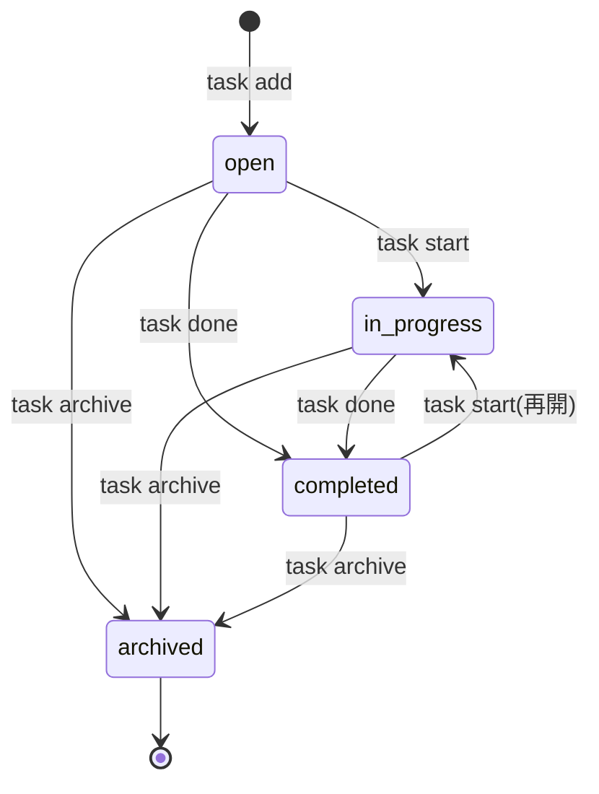

# プロジェクト用語集 (Glossary)

## 概要

このドキュメントは、TaskCLI のドキュメント・コード・CLI出力で使用する用語の定義を管理する。
ドキュメントで用語を使う際、およびコード上の名前を決める際は、本書の「英語表記」「コード上の名前」に合わせる。

**更新日**: 2026-10-03

### 表記の原則

- 日本語ドキュメントでは「日本語の用語」を使い、初出時に英語表記を括弧で併記してよい
- コード(型名・変数名・メソッド名)では「コード上の名前」を使う
- CLIのコマンド名・ステータス値など、利用者に見える英字の値は本書の表記から変えない

## ドメイン用語

### タスク

**定義**: 利用者が管理する作業の単位。1つのタイトルを持ち、ステータスによって進捗が表される

**説明**: TaskCLI の中心となる概念。1から始まる連番のIDで識別される。タスクは作業ディレクトリ(ワークスペース)ごとに管理され、他のリポジトリのタスクとは独立している。Gitリポジトリ内では、タスクを開始するとブランチが1つ紐付く

**関連用語**: [タスクID](#タスクid)、[タスクステータス](#タスクステータス)、[ブランチ紐付け](#ブランチ紐付け)

**使用例**:
- `task add "ユーザー認証機能の実装"` でタスクを作成する
- 「タスク #1 を作成しました」

**英語表記**: Task
**コード上の名前**: `Task`(型)、`task`(変数)

### タスクID

**定義**: タスクを一意に識別する正の整数

**説明**: ワークスペース内で1から順に採番される。削除されたタスクのIDは再利用しない(`nextId` で管理するため)。CLIでは `1` と `#1` のどちらの形式でも指定できる。表示時は `#1` の形式を使う

**関連用語**: [タスク](#タスク)、[タスクストア](#タスクストア)

**使用例**:
- `task show 1` / `task show #1`
- コミットトレーラー `Task: #1`

**英語表記**: Task ID
**コード上の名前**: `id`(Task のフィールド)、`taskId`(引数・エラーのプロパティ)

### タスクの開始

**定義**: タスクのステータスを `in_progress` にし、Gitリポジトリ内であれば紐付くブランチを作成または切り替える操作

**説明**: `task start` で実行する。`open` のタスクを着手する場合と、`completed` のタスクを再開する場合がある。Gitリポジトリ外ではブランチを作成せずステータスのみ変更する。Git操作が失敗した場合、タスクは変更されない

**関連用語**: [ブランチ紐付け](#ブランチ紐付け)、[タスクの再開](#タスクの再開)

**使用例**:
- `task start 1` → `feature/task-1-...` ブランチを作成して切り替える

**英語表記**: Start
**コード上の名前**: `startTask()`、アクション `'start'`

### タスクの再開

**定義**: `completed` のタスクを再び `in_progress` に戻すこと

**説明**: `task start` を `completed` のタスクに対して実行すると再開となる。タスクに記録済みのブランチがあれば、そのブランチに切り替える。`completedAt` は履歴として残る

**関連用語**: [タスクの開始](#タスクの開始)、[タスクの完了](#タスクの完了)

**英語表記**: Reopen
**コード上の名前**: 独立した関数は持たず、`startTask()` が扱う

### タスクの完了

**定義**: タスクのステータスを `completed` にし、完了日時を記録する操作

**説明**: CLIのコマンド名は `done` だが、ドメイン上の名前とステータス値は「complete / completed」で統一する。MVPではブランチのマージ等のGit操作は行わない

**関連用語**: [タスクステータス](#タスクステータス)

**使用例**:
- `task done 1` → 「タスク #1 を完了しました」

**英語表記**: Complete
**コード上の名前**: `completeTask()`、アクション `'complete'`、CLIコマンド `done`、フィールド `completedAt`

### アーカイブ

**定義**: 不要になったタスクを、削除せずに一覧のデフォルト表示から外すこと

**説明**: `task archive` で実行する。アーカイブしたタスクは tasks.json に残り、`task list --all` で確認できる。アーカイブ済みタスクは開始・完了できず、元に戻す操作はMVPでは提供しない。データ自体を消す [削除](#削除) とは異なる

**関連用語**: [削除](#削除)、[タスクステータス](#タスクステータス)

**英語表記**: Archive
**コード上の名前**: `archiveTask()`、アクション `'archive'`、ステータス `'archived'`

### 削除

**定義**: タスクを tasks.json から取り除き、復元不能にする操作

**説明**: `task delete` で実行し、`--force` がなければ確認プロンプトを表示する。ステータスに関係なく実行できる。直前の状態は [バックアップファイル](#バックアップファイル) から手動で戻せる

**関連用語**: [アーカイブ](#アーカイブ)、[確認プロンプト](#確認プロンプト)

**英語表記**: Delete
**コード上の名前**: `deleteTask()`

### ブランチ紐付け

**定義**: タスクとGitブランチを1対1で関連付けること

**説明**: タスクの開始時に、使用したブランチ名がタスクの `branch` フィールドに記録される。紐付けはタスク側にのみ保存され、Git側には情報を書き込まない。ブランチが削除されても紐付けは残る。現在チェックアウト中のブランチに紐付くタスクは、`task list` で `*` が付き、コミット時にトレーラーが追記される

**関連用語**: [タスクブランチ名](#タスクブランチ名)、[現在のタスク](#現在のタスク)

**英語表記**: Branch Link
**コード上の名前**: `Task.branch`、`findTaskByBranch()`

### タスクブランチ名

**定義**: タスクの開始時に自動生成されるブランチ名。`feature/task-<id>-<slug>` 形式

**説明**: タイトルから英数字のスラッグを作れない場合(日本語のみのタイトル等)は `feature/task-<id>` となる。`task start --branch` で任意の名前を指定した場合はそちらが優先される。生成規則は [ブランチ名生成アルゴリズム](#ブランチ名生成アルゴリズム) を参照

**関連用語**: [スラッグ](#スラッグ)、[ブランチ紐付け](#ブランチ紐付け)

**使用例**:
- `Initial setup`(ID 3)→ `feature/task-3-initial-setup`
- `ユーザー認証機能の実装`(ID 1)→ `feature/task-1`

**英語表記**: Task Branch Name
**コード上の名前**: `BranchNameGenerator.generate()`、定数 `BRANCH_PREFIX`(`'feature/task-'`)

### スラッグ

**定義**: タイトルから生成する、英小文字・数字・ハイフンのみからなる最大50文字の文字列

**説明**: ブランチ名を人間が読める形にするために使う

**英語表記**: Slug
**コード上の名前**: `slug`、定数 `MAX_SLUG_LENGTH`

### 現在のタスク

**定義**: 現在チェックアウトしているブランチに紐付いた、`archived` 以外のタスク

**説明**: `task list` で行頭に `*` が付き、`prepare-commit-msg` フックがコミットメッセージにタスク番号を追記する対象となる。detached HEAD の状態やリポジトリ外では存在しない

**関連用語**: [ブランチ紐付け](#ブランチ紐付け)、[タスクトレーラー](#タスクトレーラー)

**英語表記**: Current Task
**コード上の名前**: `findTaskByBranch(currentBranch)` の戻り値

### タスクトレーラー

**定義**: コミットメッセージの末尾に追記される `Task: #<id>` 形式の行

**説明**: Gitの「トレーラー」(メッセージ末尾の `Key: Value` 形式のメタデータ)の慣習に従う。`task hook install` で導入した `prepare-commit-msg` フックが、[現在のタスク](#現在のタスク) がある場合に自動で追記する。既に記載されている場合、マージ・squash によるコミットの場合は追記しない

**関連用語**: [コミットフック](#コミットフック)

**使用例**:
```
Add login endpoint

Task: #1
```

**英語表記**: Task Trailer
**コード上の名前**: `CommitHookService.appendTaskTrailer()`

### コミットフック

**定義**: TaskCLIが利用者のリポジトリに導入する `prepare-commit-msg` フックスクリプト

**説明**: `task hook install` で作成し、`task hook uninstall` で削除する。中身は `task hook run` を呼ぶだけのシェルスクリプトで、マーカーコメント `# managed-by: taskcli` によりTaskCLIが作成したものと識別する。既存の別のフックは上書きしない。本リポジトリの開発用フック(husky の `pre-commit`)とは別物である

**関連用語**: [タスクトレーラー](#タスクトレーラー)、[フックの競合](#hookconflicterror)

**英語表記**: Commit Hook
**コード上の名前**: `CommitHookService`

### ワークスペース

**定義**: タスクデータ(`.task/` ディレクトリ)を配置する場所と、Gitリポジトリ内かどうかの情報の組

**説明**: コマンド実行のたびに決定され、永続化しない。Gitリポジトリ内ではリポジトリのルート、リポジトリ外(またはGit未インストール)ではカレントディレクトリがルートとなる。サブディレクトリで実行しても、リポジトリ内であれば同じワークスペースを使う

**関連用語**: [タスクストア](#タスクストア)、[データディレクトリ](#データディレクトリ)

**英語表記**: Workspace
**コード上の名前**: `Workspace`(型)、`WorkspaceResolver`、フィールド `rootDir` / `dataDir` / `isGitRepository`

### 初期化

**定義**: ワークスペースに `.task/` ディレクトリと tasks.json 等を作成すること

**説明**: `task init` で明示的に行えるほか、未初期化の状態でタスクを追加すると自動で行われる(自動初期化)

**英語表記**: Initialize
**コード上の名前**: `TaskRepository.initialize()`

### 確認プロンプト

**定義**: 取り消せない操作の前に、`y/N` 形式で利用者の同意を求める表示

**説明**: `y` / `yes`(大文字小文字を区別しない)のみを同意とし、それ以外(空入力を含む)は中止とする。入力を得られないまま標準入力が終端に達した場合は削除を中止し、`--force` の利用を案内して終了コード1で終了する。MVPでは `task delete` のみが対象

**英語表記**: Confirmation Prompt
**コード上の名前**: `ConfirmPrompt`

### ヒント

**定義**: エラーメッセージに添える「どうすれば解決できるか」の案内

**説明**: すべての利用者向けエラーは、何が起きたか(メッセージ)とヒントを持つ。ヒントは可能な限り実行可能なコマンドで示す

**使用例**:
```
✗ タスク #5 が見つかりません
  task list --all で既存のタスクを確認できます
```

**英語表記**: Hint
**コード上の名前**: `TaskCliError.hint`

## 技術用語

### TypeScript

**定義**: JavaScript に静的型付けを加えたプログラミング言語

**公式サイト**: https://www.typescriptlang.org/

**本プロジェクトでの用途**: 全ソースコード・テストコードの記述。`strict` モードで使用し、`tsc` で ESM の JavaScript にコンパイルする

**バージョン**: `~5.3.0`

**関連ドキュメント**: [architecture.md](./architecture.md)、[development-guidelines.md](./development-guidelines.md)

### Node.js

**定義**: サーバーサイド・CLIで JavaScript を実行するランタイム

**公式サイト**: https://nodejs.org/

**本プロジェクトでの用途**: TaskCLI の実行環境。開発は v24.11.0、利用者の環境は 20 以降をサポートする

**バージョン**: 開発 24.11.0 / サポート `>=20`

### Commander.js

**定義**: Node.js 向けのコマンドライン引数解析ライブラリ

**公式サイト**: https://github.com/tj/commander.js

**本プロジェクトでの用途**: サブコマンド(`add`・`list` 等)の定義、オプション解析、ヘルプ生成、不明なコマンドに対する類似コマンドの提案。`src/cli/` でのみ使用する

**バージョン**: `^14.0.0`

### simple-git

**定義**: Git コマンドを Node.js から実行するためのラッパーライブラリ

**公式サイト**: https://github.com/steveukx/git-js

**本プロジェクトでの用途**: ブランチの作成・切り替え・存在確認、リポジトリルートの取得。シェルを経由せず引数配列で git を実行する。`src/infra/GitClient.ts` でのみ使用する

**バージョン**: `^3.27.0`

### string-width

**定義**: 文字列の端末上の表示幅(全角文字は2、ANSIエスケープは0)を計算するライブラリ

**公式サイト**: https://github.com/sindresorhus/string-width

**本プロジェクトでの用途**: `task list` の表で、日本語タイトルを含む列を揃える

**バージョン**: `^7.2.0`

### picocolors

**定義**: 端末出力に色を付ける軽量ライブラリ

**公式サイト**: https://github.com/alexeyraspopov/picocolors

**本プロジェクトでの用途**: ステータス・メッセージの色付け。`NO_COLOR` と非TTYで自動的に無効化される

**バージョン**: `^1.1.0`

### Vitest

**定義**: Vite ベースの JavaScript / TypeScript テストフレームワーク

**公式サイト**: https://vitest.dev/

**本プロジェクトでの用途**: ユニット・統合・E2Eテストの実行とカバレッジ計測(v8)

**バージョン**: `^2.0.0`

### prepare-commit-msg

**定義**: `git commit` 時、エディタが開く前(`-m` 指定時はコミット確定前)に実行されるGitフック。コミットメッセージのファイルパスとメッセージの出所(`message` / `merge` / `squash` 等)を引数に受け取る

**公式サイト**: https://git-scm.com/docs/githooks#_prepare_commit_msg

**本プロジェクトでの用途**: [タスクトレーラー](#タスクトレーラー) の自動追記

### アトミック書き込み

**定義**: 一時ファイルに書き込んだ後に `rename` で置き換えることで、ファイルが「書き込み前」か「書き込み後」のどちらかの完全な状態にしかならないようにする書き込み方式

**本プロジェクトでの用途**: tasks.json の保存。コマンド実行中に強制終了してもデータが破損しないことを保証する

**実装箇所**: `src/infra/JsonFileStorage.ts`

## 略語・頭字語

### CLI

**正式名称**: Command Line Interface

**意味**: ターミナルでコマンドを入力して操作するインターフェース

**本プロジェクトでの使用**: プロダクトの提供形態そのもの。また「CLIレイヤー」としてアーキテクチャのレイヤー名にも使う

### MVP

**正式名称**: Minimum Viable Product

**意味**: プロダクトとして成立する最小限の機能を備えたもの

**本プロジェクトでの使用**: PRD の優先度 P0 の機能群を指す

### P0 / P1 / P2

**正式名称**: Priority 0 / 1 / 2

**意味**: 機能要件の優先度。P0 = MVPに必須、P1 = 初期リリース後すぐに追加、P2 = 将来的に検討

**本プロジェクトでの使用**: [product-requirements.md](./product-requirements.md) の機能分類

### PRD

**正式名称**: Product Requirements Document

**意味**: プロダクト要求定義書

**本プロジェクトでの使用**: [docs/product-requirements.md](./product-requirements.md)

### KPI / NPS

**正式名称**: Key Performance Indicator / Net Promoter Score

**意味**: KPI は目標の達成度を測る指標。NPS は「他者に薦めたいか」を0〜10で尋ね、推奨者(9〜10)の割合から批判者(0〜6)の割合を引いた値

**本プロジェクトでの使用**: PRD の成功指標

### TTY

**正式名称**: TeleTYpewriter

**意味**: 端末(ターミナル)のこと。プログラムの出力先が端末か、パイプ・ファイルかを区別する文脈で使う

**本プロジェクトでの使用**: 出力先がTTYでない場合は色付けを無効化し、標準入力がTTYでない(パイプ入力の)場合は確認プロンプトの回答後に改行を補う

### NO_COLOR

**正式名称**: NO_COLOR 環境変数(https://no-color.org/)

**意味**: 設定されている場合、CLIツールが色付けを行わないという慣習

**本プロジェクトでの使用**: 値に関係なく、設定されていれば色付けを無効化する

### TDD

**正式名称**: Test-Driven Development

**意味**: テストを先に書き、それを通す実装を書く開発手法

**本プロジェクトでの使用**: 新しい振る舞いの実装時の基本手法([development-guidelines.md](./development-guidelines.md))

## アーキテクチャ用語

### レイヤードアーキテクチャ

**定義**: システムを責務ごとの層に分け、上位の層から下位の層へのみ依存させる設計手法

**本プロジェクトでの適用**: CLIレイヤー → サービスレイヤー → データ・インフラレイヤーの3層と、全層が参照するドメイン型で構成する。依存ルールは ESLint で強制する

**関連コンポーネント**: `src/cli/`、`src/services/`、`src/repositories/`、`src/infra/`、`src/domain/`

**図解**:
```
CLIレイヤー        (src/cli)            引数解析・出力・終了コード
    ↓
サービスレイヤー    (src/services)       ユースケース・ビジネスルール
    ↓
データ・インフラ    (src/repositories,   tasks.json・Git
レイヤー            src/infra)
```

### ポート

**定義**: サービスレイヤーが必要とする外部機能を表すインターフェース

**本プロジェクトでの適用**: `src/services/ports.ts` に `TaskRepositoryPort`・`GitPort`・`TextFilePort` を定義する。サービスはポートにのみ依存し、具象クラス(`TaskRepository`・`GitClient` 等)は `cli/context.ts` で注入される(依存性逆転)。これによりGitなしでサービスをテストできる

**関連コンポーネント**: `ports.ts`、`context.ts`

### コンポジションルート

**定義**: アプリケーションの依存オブジェクトをまとめて生成・接続する唯一の場所

**本プロジェクトでの適用**: `src/cli/context.ts`。CLIレイヤーで `repositories/`・`infra/` を import してよいのはこのファイルのみ

### テストダブル

**定義**: テストで本物の依存の代わりに使うオブジェクトの総称(フェイク・スタブ・モック等)

**本プロジェクトでの適用**: `tests/helpers/fakes.ts` の `InMemoryTaskRepository`・`FakeGit`・`FixedClock`。ポートを実装したインメモリの代替物として使う

### ステアリングファイル

**定義**: 個々の開発作業について「今回何をするか」を記録するドキュメント群

**本プロジェクトでの適用**: `.steering/[YYYYMMDD]-[作業名]/` に `requirements.md`・`design.md`・`tasklist.md` を作成する。永続ドキュメント(`docs/`)が「何を作るか」を定義するのに対し、作業単位の計画と進捗を管理する

**関連ドキュメント**: [CLAUDE.md](../CLAUDE.md)、[repository-structure.md](./repository-structure.md)

## ステータス・状態

### タスクステータス

| ステータス | 意味 | 遷移条件 | 次の状態 |
|----------|------|---------|---------|
| `open` | 新規。まだ着手していない | `task add` で作成された | `in_progress`、`completed`、`archived` |
| `in_progress` | 作業中 | `task start` を実行した | `completed`、`archived` |
| `completed` | 完了 | `task done` を実行した | `in_progress`(再開)、`archived` |
| `archived` | アーカイブ済み。一覧のデフォルト表示から除外 | `task archive` を実行した | なし(終端) |

**表示上の扱い**: ステータス値は日本語に訳さず、英字のまま表示する(`task list` の Status 列、`task show`)。ドキュメントでは「作業中(`in_progress`)」のように併記してよい

**状態遷移図**:


**コード上の名前**: `TaskStatus` 型、定数 `TASK_STATUSES`、判定は `StatusTransitionPolicy`

### ブランチ操作の結果

| 値 | 意味 |
|----|------|
| `created` | 新しいブランチを作成して切り替えた |
| `switched` | 既存のブランチに切り替えた |
| `skipped_no_git` | Gitリポジトリ外のためブランチ操作を行わなかった |

**コード上の名前**: `StartTaskResult.branchAction`

## データモデル用語

### Task

**定義**: タスク1件を表すデータ

**主要フィールド**:
- `id`: [タスクID](#タスクid)(正の整数)
- `title`: タイトル(1〜200文字、改行を含まない)
- `description`: 説明(任意、10,000文字以下)
- `status`: [タスクステータス](#タスクステータス)
- `branch`: 紐付くブランチ名(任意)
- `createdAt` / `updatedAt`: 作成・更新日時(ISO 8601、UTC)
- `completedAt`: 最後に完了した日時(任意)

**関連エンティティ**: [タスクストア](#タスクストア)

**制約**: `id` はタスクストア内で一意

### タスクストア

**定義**: ワークスペース内の全タスクと採番情報をまとめた、tasks.json の内容全体

**主要フィールド**:
- `schemaVersion`: [スキーマバージョン](#スキーマバージョン)
- `nextId`: 次に採番するタスクID
- `tasks`: タスクの配列(ID昇順)

**制約**: `nextId` は既存の最大ID + 1 以上

**英語表記**: Task Store
**コード上の名前**: `TaskStore`

### スキーマバージョン

**定義**: tasks.json のデータ形式のバージョンを表す整数

**説明**: 現行は `1`。形式を変更する際に値を上げ、古い形式はマイグレーションで自動変換する。ツールが知らない新しいバージョンのデータは、破壊を防ぐため読み込みを拒否する

**コード上の名前**: `schemaVersion`、`src/repositories/migrations.ts`

### データディレクトリ

**定義**: ワークスペースのルート直下にある `.task/` ディレクトリ

**構成**:
- `tasks.json`: [タスクストア](#タスクストア)
- `tasks.json.bak`: [バックアップファイル](#バックアップファイル)
- `.gitignore` / `.gitattributes`: バックアップ・一時ファイルの除外と改行コードの固定

**コード上の名前**: `Workspace.dataDir`

### バックアップファイル

**定義**: tasks.json を書き込む直前の状態を保存した `.task/tasks.json.bak`

**説明**: 1世代のみ保持する。Git管理外。tasks.json の破損時や誤操作の直後に、手動でコピーして復元する

## エラー・例外

すべての利用者向けエラーは `TaskCliError` を継承し、メッセージと [ヒント](#ヒント) を持つ。CLIは `✗ メッセージ` とヒントを標準エラー出力に表示し、終了コード `1` で終了する。

### ValidationError

**クラス名**: `ValidationError`

**発生条件**: タイトルが空・200文字超、説明が10,000文字超、タスクIDが正の整数でない

**対処方法**: 入力値を修正して再実行する

**例**:
```typescript
throw new ValidationError('タイトルは1〜200文字で入力してください(現在: 0文字)');
```

### TaskNotFoundError

**クラス名**: `TaskNotFoundError`

**発生条件**: 指定したIDのタスクが存在しない(削除済みを含む)

**対処方法**: `task list --all` で既存のタスクIDを確認する

### InvalidStatusTransitionError

**クラス名**: `InvalidStatusTransitionError`

**発生条件**: [タスクステータス](#タスクステータス) の遷移表で許可されていない操作(例: 完了済みタスクの `task done`、アーカイブ済みタスクの `task start`)

**対処方法**: ヒントに示された操作(再開なら `task start`)を行う

### InvalidBranchNameError

**クラス名**: `InvalidBranchNameError`

**発生条件**: `task start --branch` に、Gitで使用できない名前、または `-` で始まる名前を指定した

**対処方法**: 英数字・ハイフン・スラッシュからなる名前を指定する

### GitOperationError

**クラス名**: `GitOperationError`

**発生条件**: ブランチの作成・切り替えなどのGit操作が失敗した(未コミットの変更との競合など)。Gitのエラー出力を保持する

**対処方法**: 変更をコミットするか `git stash` で退避してから再実行する。タスクは変更されていない

### NotGitRepositoryError

**クラス名**: `NotGitRepositoryError`

**発生条件**: Gitリポジトリ外で `task hook install` / `task hook uninstall` を実行した

**対処方法**: Gitリポジトリ内で実行する

### HookConflictError

**クラス名**: `HookConflictError`

**発生条件**: TaskCLI 以外が作成した `prepare-commit-msg` フックが既に存在する

**対処方法**: 既存フックに `task hook run "$1" "$2" || true` の1行を手動で追加する

### CorruptedDataError

**クラス名**: `CorruptedDataError`

**発生条件**: tasks.json が JSON として読めない、または必須フィールドの型が不正

**対処方法**: `cp .task/tasks.json.bak .task/tasks.json` でバックアップから復元する。TaskCLI はこのエラー時にファイルを上書きしない

### UnsupportedSchemaError

**クラス名**: `UnsupportedSchemaError`

**発生条件**: tasks.json の [スキーマバージョン](#スキーマバージョン) が、実行中の TaskCLI より新しい

**対処方法**: TaskCLI を最新版に更新する

### FileSystemError

**クラス名**: `FileSystemError`

**発生条件**: `.task/` への書き込み権限がない、ディスクが一杯など、ファイル操作が失敗した

**対処方法**: ディレクトリの権限と空き容量を確認する

## 計算・アルゴリズム

### ブランチ名生成アルゴリズム

**定義**: タスクIDとタイトルから [タスクブランチ名](#タスクブランチ名) を生成する手順

**計算式**:
```
slug = タイトル
       → Unicode NFKC 正規化
       → 小文字化
       → [a-z0-9] 以外の連続を "-" 1つに置換
       → 先頭・末尾の "-" を除去
       → 50文字で切り詰め、末尾の "-" を除去

ブランチ名 = slug が空 ? "feature/task-<id>" : "feature/task-<id>-<slug>"
```

**実装箇所**: `src/services/BranchNameGenerator.ts`

**例**:
```
入力: id=5, title="OAuth2.0対応(Google)"
出力: feature/task-5-oauth2-0-google
```

### 表示幅

**定義**: 文字列が端末上で占める列数。半角文字は1、全角文字は2、ANSIエスケープは0として数える

**実装箇所**: `src/cli/presenters/TablePresenter.ts`(string-width を使用)

**例**:
```
入力: "ユーザー認証"
出力: 12
```

## 索引

### あ行
- [アーカイブ](#アーカイブ)
- [アトミック書き込み](#アトミック書き込み)

### か行
- [確認プロンプト](#確認プロンプト)
- [現在のタスク](#現在のタスク)
- [コミットフック](#コミットフック)
- [コンポジションルート](#コンポジションルート)

### さ行
- [削除](#削除)
- [初期化](#初期化)
- [スキーマバージョン](#スキーマバージョン)
- [ステアリングファイル](#ステアリングファイル)
- [スラッグ](#スラッグ)

### た行
- [タスク](#タスク)
- [タスクID](#タスクid)
- [タスクストア](#タスクストア)
- [タスクステータス](#タスクステータス)
- [タスクトレーラー](#タスクトレーラー)
- [タスクの開始](#タスクの開始) / [再開](#タスクの再開) / [完了](#タスクの完了)
- [タスクブランチ名](#タスクブランチ名)
- [データディレクトリ](#データディレクトリ)
- [テストダブル](#テストダブル)

### は行
- [バックアップファイル](#バックアップファイル)
- [ヒント](#ヒント)
- [表示幅](#表示幅)
- [ブランチ紐付け](#ブランチ紐付け)
- [ポート](#ポート)

### ら行・わ行
- [レイヤードアーキテクチャ](#レイヤードアーキテクチャ)
- [ワークスペース](#ワークスペース)

### A-Z
- [CLI](#cli)、[Commander.js](#commanderjs)、[KPI / NPS](#kpi--nps)、[MVP](#mvp)、[NO_COLOR](#no_color)、[Node.js](#nodejs)、[P0 / P1 / P2](#p0--p1--p2)、[picocolors](#picocolors)、[prepare-commit-msg](#prepare-commit-msg)、[PRD](#prd)、[simple-git](#simple-git)、[string-width](#string-width)、[TDD](#tdd)、[TTY](#tty)、[TypeScript](#typescript)、[Vitest](#vitest)
